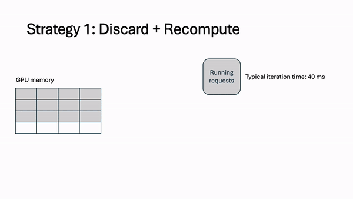
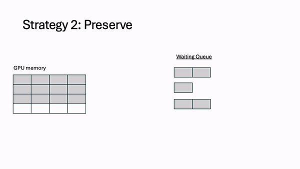
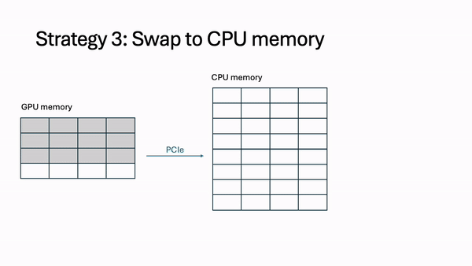
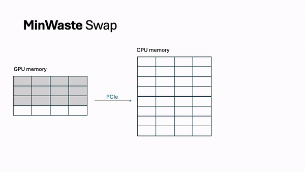
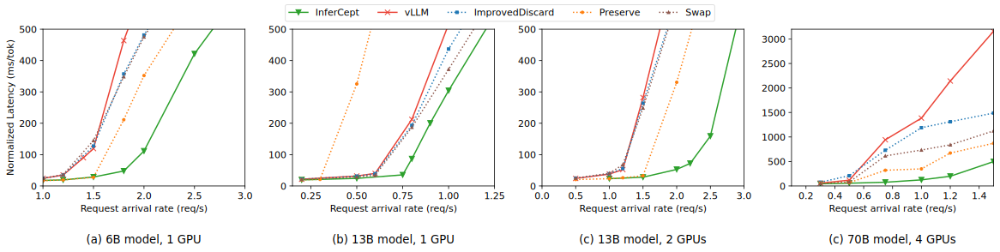

**TLDR:** Today's large language models (LLMs) are being paired with various tools and environments to satisfy increasingly complex user queries. Augmenting models with these capabilities means LLM inference can be intercepted by external actions. We designed [InferCept [ICML '24]](https://arxiv.org/pdf/2402.01869), the first serving framework designed for augmented LLMs. InferCept minimizes resource waste and achieves **1.6x-2x higher serving throughput**, completing twice as many requests compared to state-of-the-art serving systems.

## LLMs Today Are Augmented with External Tools and Environments
Recent advancements in LLMs have showcased their remarkable potential in tasks like natural language understanding and content generation. However, LLMs alone are limited to generating text. To broaden their capabilities for more diverse tasks, there's a growing trend of augmenting LLMs with external tools and real-time interaction interfaces, such as ChatGPT plugins, non-language models, math tools, and virtual environments. This trend essentially expands LLMs' functionalities by allowing various tools, humans, and environments to intercept LLM’s generation flow and feed external sequences back. We refer to all such non-LLM usages as “interceptions.” 

The user submits a natural language prompt to the model, and the model will generate output tokens accordingly. However, an interception can be triggered at any time. This is because the language model is either prompted or fine-tuned to generate a query for a set of augmentations. For example, in the prompt, the user can specify instructions on how to query the Wikipedia API, along with demonstrations the model can learn from.


The workflow is as follows:
1. LLM generates tokens that query a particular tool, environment, or even another language model (an “augmentation”).
2. The serving system waits for a response while the query is dispatched to the augmentation.
3. When the request is ready to resume, the serving system appends the response from the augmentation and continues normal generation.

In studying the behavior of 6 different augmentations, we find that a given user’s request can be intercepted frequently, ranging on average from just 3 times to as high as 28 times. The execution times also vary greatly depending on the augmentation. Tools like calculators are very fast, returning back to the model in < 1 second. Other machine learning models such as text-to-speech and stable diffusion can take 20x longer. The next-generation system has to account for all of these possibilities. 

## Today’s Techniques to Handle Interceptions
When a request is intercepted, current systems [1] evict all token states (i.e. its cached key and value vectors generated during the attention computation) for that request. When the augmentation finishes, the KV cache is restored via recomputation. When a variety of augmentations are being queried, 37% of end-to-end execution time is spent restoring the token state, and as a result, 27% of GPU memory is wasted. 

There are three techniques to deal with interceptions.
1. **Discard**. This is the current technique used by today’s systems. Discarding token states frees that memory immediately for other requests to use. However, it also results in the running requests being slowed down by the large prefill recomputation that has to occur when the interception finishes. A typical model forward pass can take over 5x longer in the prefill stage. 



2. **Preserve**. The token states remain in GPU memory and wait for the interception to finish, at which point it can resume immediately (no computation needed). However, this memory is unusable for other requests for the duration of the interception. 



3. **Swap**. We can swap token states out to CPU memory, such as in offloading-based systems. This alleviates the need for recomputation and frees up memory on the GPU, but those token states must be swapped in when the interception is finished. Additionally, swapping can also stall other running requests because the amount of data being swapped greatly exceeds the limited CPU-GPU bandwidth. 



## Introducing InferCept
We built InferCept to efficiently handle interceptions with three core aspects:
1. Optimizing for GPU memory waste
2. Improving existing techniques individually
3. Scheduling requests efficiently

### Optimizing for GPU memory waste
The key idea behind InferCept is to minimize the memory waste caused by interceptions. We treat memory waste as the amount of unused memory * duration it is unused. Within this framework, we can introduce a formula for computing the waste associated with each technique. Then, we can compute a **WasteDiscard**, **WastePreserve**, and **WasteSwap** term for each intercepted request. Whichever technique incurs the least waste is the technique we use for that request.  

### Improving existing techniques
For **WasteDiscard** and **WasteSwap**, we pipeline the recomputation and swapping out and in for increased throughput. During prefill recomputation, we integrate chunked prefills as proposed by Sarathi [^2]. We also profile the model and hardware to obtain a throughput-optimal chunk size. This reduces stalling for running requests and decreases GPU memory waste.


For swapping, we overlap all data communication with computation. By profiling the model and the CPU-GPU bandwidth, we can identify a swapping budget in terms of the number of tokens we are allowed to swap without incurring extra latency. This allows us to completely eliminate all waste from swapping.



### Scheduling requests efficiently
With the above optimizations, we can completely eliminate **WasteSwap** from the decision calculus. Instead, in each iteration, we max out the swapping budget with the most wasteful interception. Then, we either preserve or discard the remaining intercepted requests. Due to offline profiling, **WasteDiscard** and **WastePreserve** are easy to compute and incur no additional overhead during scheduling. We obey first-come first-served (FCFS) scheduling by bumping completed interceptions to the front of the waiting queue.

## Results
We compare against four baselines:
- vLLM [1] (SoTA) -- treating interceptions the same as completion
- ImprovedDiscard -- discards token states but keeps original arrival time
- Preserve -- keep all token states in memory
- Swap -- offload all token states to CPU memory

For our evaluation, we compose a dataset of six different augmentations: a calculator API, a wikipedia API, a stable diffusion model, a text-to-speech model, an embodied agent in a virtual environment, and a chatbot (where the user providing follow-ups is the augmentation). Each of these augmentations vary significantly in both invocation frequency and duration. This represents the growing diversity of usages for augmented language models.



InferCept sustains 1.6x higher request arrival rates at the same low latency as vLLM, while completing 2x more requests per second. It also has 1.9x-5.7x lower normalized latency per output token. These findings hold for larger models and for distributed inference, where we see up to 12x lower latency and 2x higher serving load. 

## Our Vision
We see augmented models as the future of LLMs, whether it’s with simple tools like calculators or complex multi-agent systems. Hence, the interactions between LLMs and the outside world must be studied and optimized to satisfy increasingly complex tasks.

<hr>

You can play around with InferCept [here](https://github.com/WukLab/InferCept/tree/main)! If you use InferCept for your research, please cite our paper:
```bibtex
@inproceedings{
  abhyankar2024infer,
  title={INFERCEPT: Efficient Intercept Support for Large-Language Model
Inferencing},
  author={Reyna Abhyankar and Zijian He and Vikranth Srivatsa and Hao Zhang and Yiying Zhang},
  booktitle={Forty-first International Conference on Machine Learning},
  year={2024},
  month=Jul,
  address={Vienna, Austria},
}
```


### Citations

[1] Kwon, Woosuk, et al. "Efficient memory management for large language model serving with paged attention." Proceedings of the 29th Symposium on Operating Systems Principles. 2023.

[2] Agrawal, Amey, et al. "Sarathi: Efficient llm inference by piggybacking decodes with chunked prefills." arXiv preprint arXiv:2308.16369 (2023).
