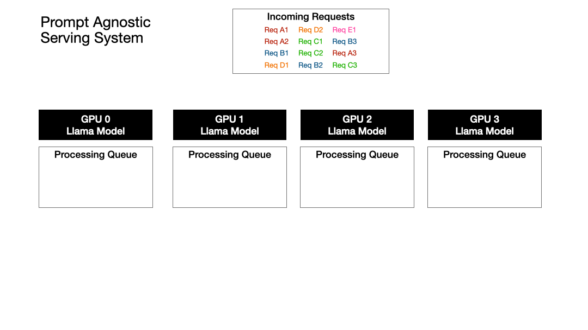
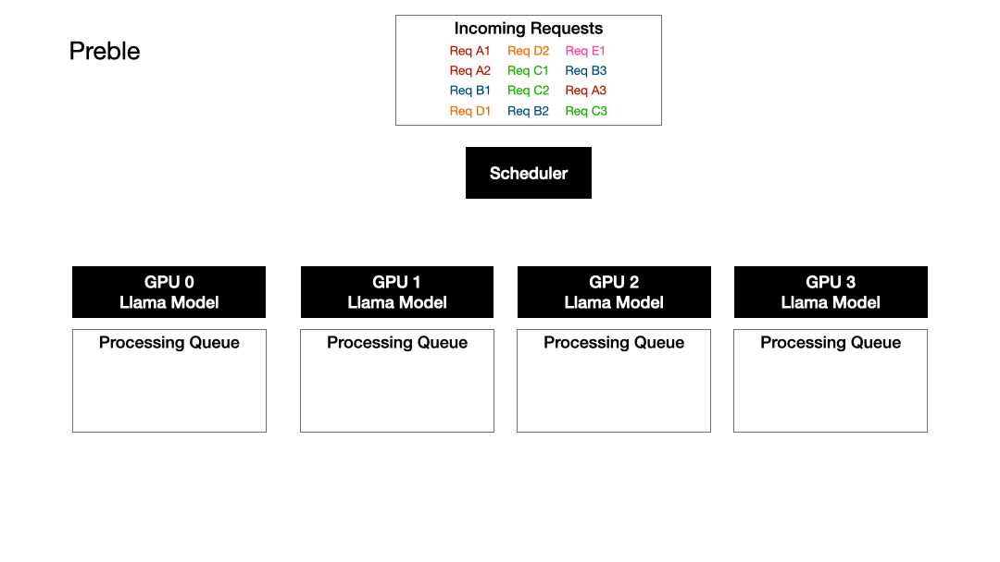
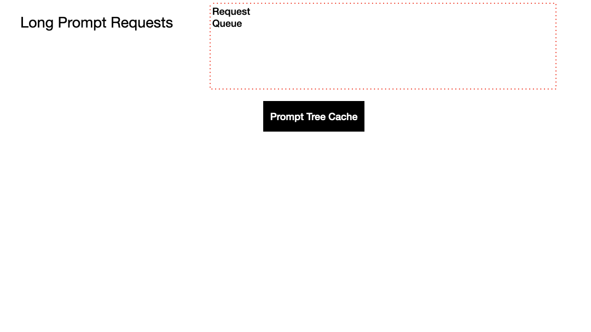
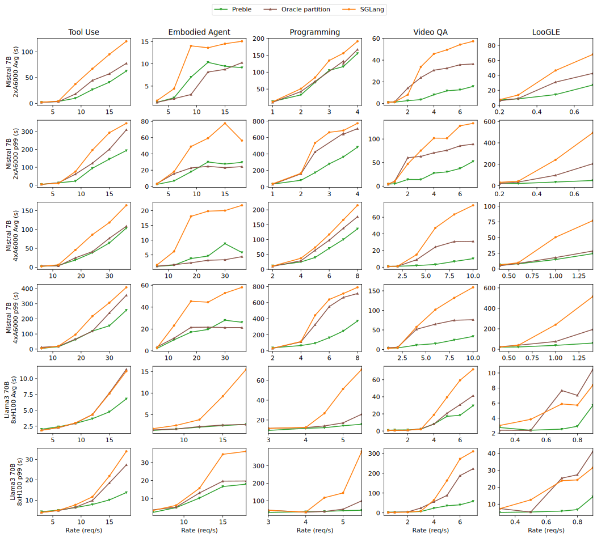
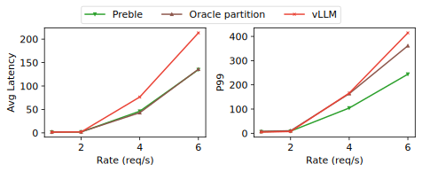
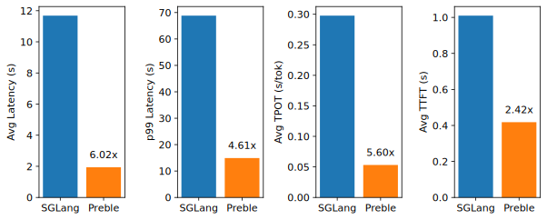

LLM prompts are growing more complex and longer with agents, tool use, large documents, video clips, and detailed few-shot examples. These prompts often have content that is shared across many requests. The computed intermediate state (KV cache) from one prompt can be reused by another for their shared parts to improve request handling performance and save GPU computation resources. However, current distributed LLM serving systems treat each request as independent and miss the opportunity to reuse the computed intermediate state. 
We introduce Preble, the first distributed LLM serving system that targets long and shared prompts. Preble achieves 2-10x average latency and 2-14x p99 latency over SOTA serving systems. The core of Preble is a new E2 Scheduling that optimizes load distribution and KV cache reutilization.  Preble is compatible with multiple serving backends such as vLLM and SGLang.

## Background: Prefix Caching + Data Parallel handing
### Prefix Caching
When a long prompt arrives, the LLM processes it and stores the result in an intermediate state (KV Cache). When the same long prompt arrives again with a different followup question, prefix caching can be used to prevent recomputing the same sequence again. Since LLM use positional encoding on the sequence, two non-exact similar sequences will have very different intermediate state. 

Since current LLM Serving systems are memory bottlenecked, improving the utilization of the KV cache can drastically improve the performance of LLM Serving systems.

### Data Parallel Model Scheduling
When scaling up a serving system to serve more customers, common techniques include model parallelism, data parallelism, and pipeline parallelism. Data parallelism involves creating multiple copies of the model in order to process requests in parallel. Data parallelism has less synchronization/network overhead and scale to more systems than just model and pipeline alone. Preble improves the scheduling performance for the data parallel scheduling. 

## Existing systems

Majority of existing serving systems such as sgLang, vLLM, deepspeed-mii, tgi treat requests as independent. They are also built for longer decode versus the current state of long prompt workloads.



By building a scheduler that considers the sharing properties across different requests, we can better route requests to the right gpu.



## Long Prompt Workloads



There is a rise of long prompt workloads that have a significantly longer prompt than output length. For LLMs to solve complex problems, today's practices are to include domain-specific instructions, illustration of tool usages, and long context such as textbook chapters in prompts. As such, many parts of prompts are repetitive across requests that can be reused to improve performance. 

We list a few example workloads below, which represent different complex usages. In the diagram above, we display the workloads as it gets processed. The parts reused by multiple requests are highlighted.

Tools/Agents: Today, LLMs are often augmented by various tools such as calculators and web searches. To equip a model with the ability to invoke a tool, it must be given the correct syntax for querying the tool, along with examples of tool use. We use the Toolbench dataset, which consists of more than 210k queries that call over 16k unique tools. Each query shares the same system prompt followed by tool-specific instructions. The final part of the query is the user’s specific question or task. 

The Toolbench workload is also representative of other tasks that prep an LLM in a similar fashion. This is similar to agent/role based systems that prep the LLM to perform a certain task.


Virtual Environment/Chain of Thought: LLMs are increasingly found in agents that can interact with environments, such as a player in a role-playing game or controlling a robot. In this scenario, the LLM receives feedback from the environment, forms an action, and then performs the action. This is conducted in a loop until the model has achieved the goal. The workload we utilize is sourced from the ALFWorld dataset and has 7.5k requests.

The Virtual environment is representative of a wide variety of other use cases, such as chain of thought, multi-turn tool usage, and chatbots.

Video QA/Multi Modality QA: The advent of video models like OpenAI Sora~\cite{sora} has created an explosion of interest in multi-modal models. The use of LLMs, then, goes beyond natural language. A recent usage is to answer questions about videos by tokenizing a video segment and inputting it to an LLM.  To study this, we analyze the NExT-QA benchmark, which consists of 8.5K questions for 1000 video segments. Apart from videos, images and audio can also be tokenized to have LLMs answer questions, and we expect them to have similar properties as video QA

Document QA/RAG: With newer models, the maximum context length has increased substantially, with the latest development supporting 1M tokens. Longer contexts enable new LLM applications such as asking questions about a long document or even a book. We evaluate this usage with the LooGLE dataset \cite{li2023loogle}, a collection of 776 long documents and over 6.4k questions. LooGLE has a small system prompt of 13 tokens followed by a long document and then a question about the document. 

Program Generation/Few Shot Learning: One of the popular uses of LLMs is to generate software programs. We study the APPS competitive programming dataset, a dataset of programming problems. To generate better-quality programs, an approach taken by a recent paper is to add a demonstration of several generic code examples before the user problem to instruct an LLM. This added demonstration is the same across all problems and becomes the system prompt. Depending on how complex the problem is, its description could be longer or shorter than the system prompt
 
We study these workloads and find a few insights:
- prompts are significantly longer than output lengths because LLMs support longer context and new LLM usages keep emerging
- Prompt sharing, or reuse, is common, and the sharing amount is high. Sharing can come from different user requests needing the same tools or instructions to solve a task
- Most requests have a portion of the prompt sequence that gets a different degree of sharing and is longer than its prefix, reflected as a key portion in prefix trees
- Real-world LLM usages have varying load intensity, and different usages (programming vs. conversation) have different loads

This has the following implications:
- Optimizing prompt processing computation can largely improve overall application performance, and imbalanced prompt processing and generation computation features should be considered in LLM serving.
- Reuse computation across shared prefixes can largely improve real workloads' performance and should be efficiently supported by distributed LLM serving systems.
- An efficient LLM serving system should consider complex, mixed-usage scenarios and factor in both load and prompt sharing variations. 				

## Splitting requests between multiple gpus: Scheduling *Our key insight
If you had two large documents and two gpus, intuitively one might try to send the first document to one gpu and the second document to the other gpu. However, the properties of LLM processing make this more complicated. 

The core properties that make it hard are Co-location of Computation and Storage and handling Load Balancing. For more details on the scheduling policy, please check out the paper. 

In order to balance both the load and balance the cache hit, we use E2 scheduling which balances both Exploration + Exploitation. Exploration sends the request to the gpu that has less load and exploitation sends the request to the gpu that has the greatest cache hit. This idea is inspired from the reinforcement learning space. 

E2 picks exploitation when reusing a prefix saves more computation than doing new work. This happens when the shared prefix is longer than the remaining part of the prompt. If the shared prefix is shorter, E2 chooses exploration.


From the diagram, we can see that preble scheduling chooses when to explore a cache hit versus load balance via replication. Exploitation suffers from underutilization. Exploration suffers from inability to take advantage of the cache.

## The Load Cost Equation

We determine whether to exploit or explore based on three components. We calculate a load cost for each GPU and picks the min one
- L: Estimated total request load at the time of and after current request running
- E: Load to be evicted to run the current request
    - We make a simplifying assumption about this eviction
- R: Cost to run the current request on the GPU

Cost = L + E + R

## How do you manage request scheduling globally?

When a request arrives, we first tokenize the request, then use the load cost question to determine which machine to send it to. 

## Evaluating the effectiveness of Preble

We evaluated this across 5 different workloads, 2 different models, and 2 different gpu and find a consistent improvement across all systems. 



Compared to SGLang as a backend, vLLM as a backend gives Preble less relative improvement for several reasons:
1) local-GPU prefix sharing is in beta version and not as performant as SGLang;  
2) vLLM does not use the flash infer kernel which makes prefix sharing more efficient; and 
3) vLLM does not support chunked prefill together with prefix caching. 
We also wanted to see how it performs on more bursty workloads and mixed trace


*Results with VLLM on VideoQA workload*


*Results on a real microsoft trace combining two workloads*

## Acknowledgement
I’d like to thank Junda Chen, Yutong, Ryan, Nishit, Max Hopkins, and Geoff for providing feedback and their advice. I’d also like to thank 

## Open Source/Package
This is ready to install/run at 
```
pip3 install preble
preble run sglang/vllm –port XXX –model XXX
```

## Citation

```
@article{srivatsa2024preble,
  title={Preble: Efficient Distributed Prompt Scheduling for LLM Serving},
  author={Srivatsa, Vikranth and He, Zijian and Abhyankar, Reyna and Li, Dongming and Zhang, Yiying},
  year={2024}
}
```

				
			
