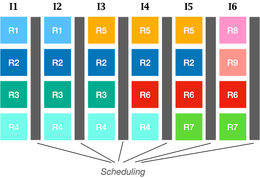
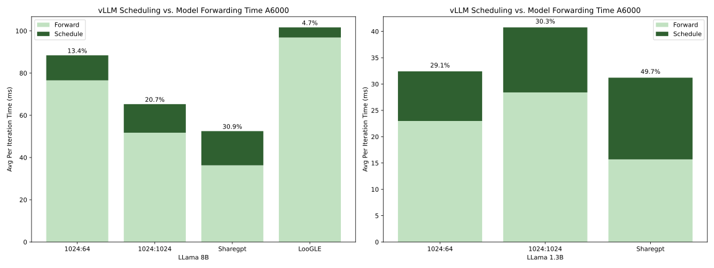
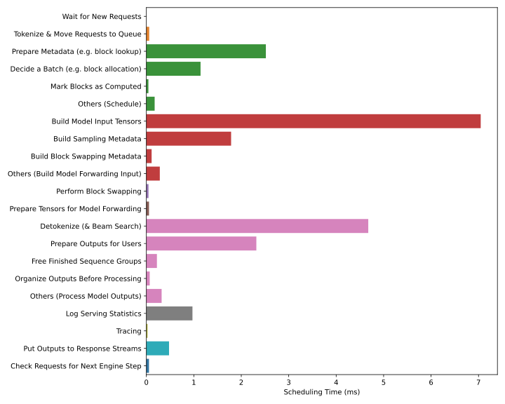
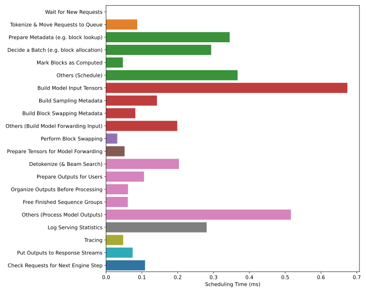
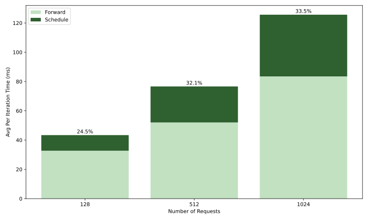
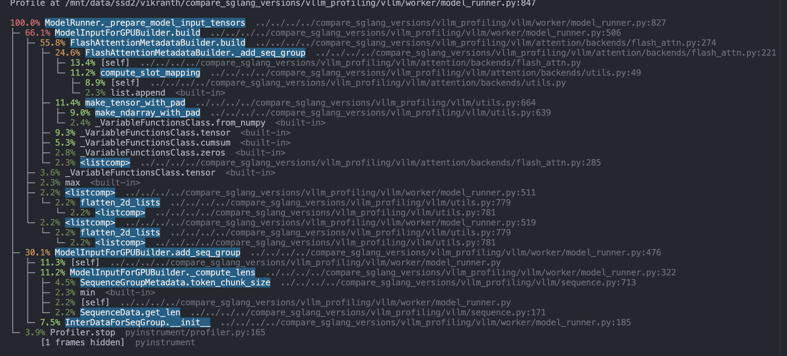
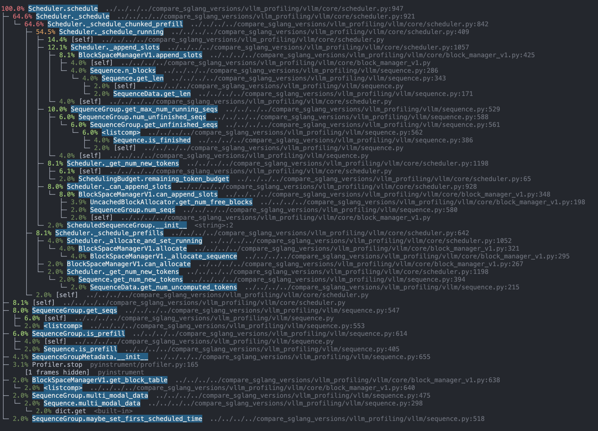
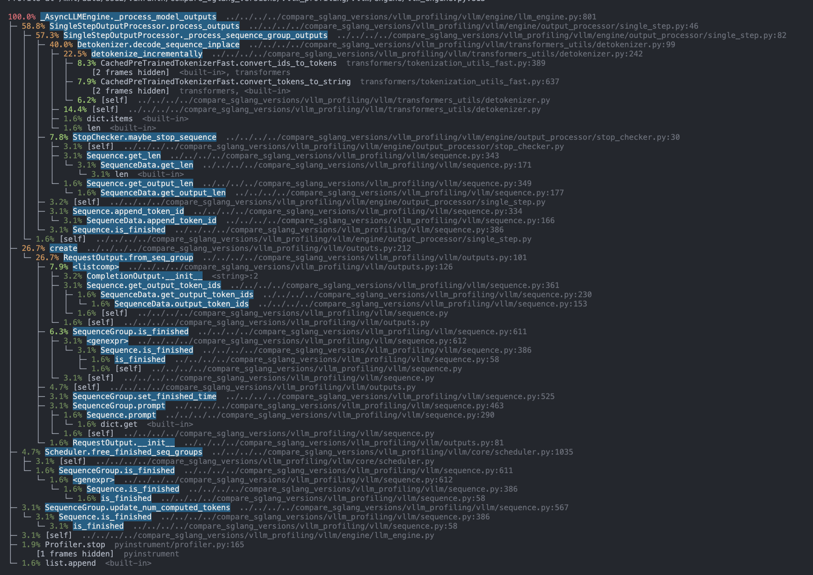
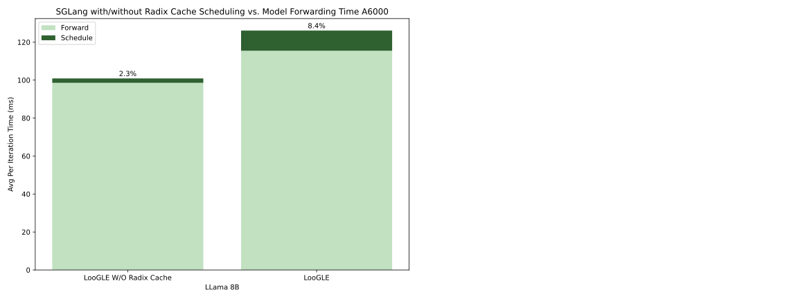

## Can Scheduling Overhead Dominate LLM Inference Performance? A Study of CPU Scheduling Overhead on Two Popular LLM Inference Systems

Author: Vikranth, Dongming, Yiying, Reyna

**TL;DR:**

Today’s LLM serving systems like [vLLM](https://github.com/vllm-project/vllm) and [TGI](https://huggingface.co/docs/text-generation-inference/en/index)  primarily use a scheduling approach called iterative scheduling (or continuous batching), which decides the batch composition at every round (or every few rounds) of model forwarding. Different from prior serving systems that schedule the next batch after the entire current batch finishes, iterative scheduling promises to improve GPU utilization and LLM serving rate, but with a key assumption: the scheduling overhead can be ignored. While this assumption generally held in the past, it is worth reexamination as today’s LLM [inference kernels](https://flashinfer.ai/) run much faster than before and as more scheduling tasks and considerations get added. 

To understand the tradeoffs of iterative scheduling in today's environment, we performed a detailed analysis of two popular SoTA LLM inference systems, [vLLM](https://github.com/vllm-project/vllm) and [SGLang](https://github.com/sgl-project/sglang). Our evaluation results show that **vLLM’s scheduling overhead can take more than half of the total inference time**. By breaking down its scheduling functionalities, we found the major overhead came from tensor pre- and post-processing. Our evaluation of SGLang shows much lower scheduling overhead, primarily due to its simplified tensor processing. Based on our evaluation results and source code analysis, we make suggestions on potential improvements in vLLM’s scheduler.

## Background and Motivation

LLM inference today performs batched model forwarding by sending a batch of requests to the GPU at a time. Prior LLM inference systems schedule a subsequent batch after all the requests in the current batch finish their generation, which causes GPU resource waste as some requests in a batch finish earlier and wait for the others. [Iterative LLM inference scheduling](https://www.usenix.org/conference/osdi22/presentation/yu) mitigates this issue by constructing a batch after each model forwarding iteration, where each iteration executes a prompt prefilling and/or one decoding token generation. With chances of adding new requests to a batch at any iteration, iterative scheduling largely improves GPU utilization. 

Typically, LLM scheduling involves post-processing requests (sampling and detokenization) from the previous batch, selecting requests to include in the next batch, and preparing a new request (e.g., tokenization) for model forwarding. A key assumption iterative scheduling makes is that the scheduling delay is much smaller than an iteration of model forwarding time. Thus, scheduling at each iteration is acceptable. 

Two new developments in LLM inferencing are challenging this assumption. First, model forwarding has become much faster with new inference kernels like [FlashInfer3](https://flashinfer.ai/). As a result, the relative time spent on scheduling is more significant. Second, today’s scheduling systems often undertake more tasks with more considerations. For example, a technique called [chunked prefill](https://arxiv.org/abs/2308.16369) separates a prompt into multiple chunks, each executed in one iteration with other decoding requests, thereby improving GPU utilization. Supporting chunked prefill adds to the tasks of a scheduler at the iteration level. Such added tasks inevitably increase the scheduling delay.

***Has the tipping point come that scheduling now dominates the model inference time?***

To answer this question scientifically, we performed a detailed study on two LLM inference systems, [vLLM](https://github.com/vllm-project/vllm) and [SGLang](https://github.com/sgl-project/sglang).   

**Figure 1: Illustration of Iterative Scheduling.** Rx represents xth request. Ix represents xth iteration. In I3, I4, I5, I6, new requests get added to the batch as previous requests finish.

## Evaluation Methodology

We ran vLLM v0.5.4 and the latest SGLang (commit hash tag 3694f8f996e25c862cd67057e2bfa5844900fc98). We set up vLLM v0.5.4 with its default configurations, which use the [FlashInfer3](http://flashinfer.ai) kernel, adopt [chunked prefill](https://arxiv.org/abs/2308.16369), disable prefix caching, and disable multi-step scheduling. We set the token bucket size (maximum number of tokens in a batch for each iteration) to 512 to ensure the model forwarding is compute-bound. We use the default SGLang configurations, which use the same FlashInfer3 kernel, enable prefix caching, has no chunked prefill, and enable 10-step scheduling when a batch has no prefill (i.e., schedule after 10 iterations if a current batch is decode-only). We conducted our profiling using the Nvidia Nsight System, with time measurement code injected to capture precise model forwarding and scheduling times.

Our test workloads included synthetic and real workloads. Real datasets include [ShareGPT](https://huggingface.co/datasets/anon8231489123/ShareGPT_Vicuna_unfiltered), which represents chat usages and has similar output and prompt lengths, and [LooGLE](https://arxiv.org/abs/2311.04939), a document QA dataset with an average prompt-to-output length ratio of 32,000 to 50\. For synthetic workloads, we fix the prompt and output length, for example, to 1024-token prompt and max 64-token output (“1024:64” in the figures below) with fake tokens. By default, we send 300 requests at once to the system to create a constant load unaffected by request arrival patterns. Doing so ensures that our measurement of model forwarding and scheduling time, the focus of this study, is unaffected by request arrival patterns.

We benchmarked three models — the [Llama-1.3B](https://huggingface.co/princeton-nlp/Sheared-LLaMA-1.3B) model, the [Llama3-8B](https://huggingface.co/meta-llama/Meta-Llama-3-8B) model, and the [Llama3-70B model](https://huggingface.co/meta-llama/Meta-Llama-3-70B) — to assess the performance variations across different model sizes. We ran our experiments on one Nvidia A6000 GPUs in our local Intel(R) Xeon(R) Gold 5218 servers and up to four Nvidia A100 GPUs in RunPod.

## vLLM Scheduling Overhead Analysis  

**Figure 2: vLLM Scheduling Time vs. Model Forwarding Time on A100 GPUs**

Figure 2 presents the median per-iteration model forwarding time and scheduling time of vLLM running different workloads and models. Our results show that scheduling can take as high as half of the total end-to-end inference latency. The scheduling overhead gets relatively higher with the smaller model because the model forwarding time of a small model is faster but the scheduling overhead is not impacted by model sizes as much. Comparing across workloads, we observe workloads with longer output generation (1024:1024, ShareGPT) incur higher scheduling overhead. As we will show in the next section, vLLM’s scheduling overhead increases with more requests in a batch. Workloads with longer outputs have more requests performing decoding stages. For the same batch size in token counts, a batch can accommodate more decoding requests than prefill requests. Thus, for workloads with more decoding, the number of requests in a batch is larger, causing higher scheduling overhead. Loogle has the lowest scheduling overhead for two reasons. First, its model forwarding time is longer than other workloads. Second, the number of requests in a batch is smaller than other workloads, causing less scheduling overhead.

**Figure 3: vLLM Scheduling Time vs. Model Forwarding Time on A6000 GPUs**

We also tested the same set of workloads on our local servers, each consisting of two A6000 Nvidia GPUs and Intel(R) Xeon(R) Gold 5218 CPUs. Figure 3 presents these results. The A6000 GPUs model forwarding is much slower than A100. The relative scheduling overhead is lower than A100, as the model forwarding running on GPU gets slower. 

## Scheduling Overhead Breakdown

To understand where vLLM’s scheduling overhead come from, we analyze the breakdown of its scheduling tasks, as shown in Figure 4 and Figure 5 below. 

**Figure 4: vLLM Scheduling Time Breakdown.** Running 1024:1024 with Llama-8B on A6000.  

**Figure 5: vLLM Scheduling Time Breakdown.** Running Loogle with Llama-8B on A6000.  

Overall, we found that the actual scheduling algorithm contributes only a small portion of the overall scheduling overhead. The majority of the overhead arises from the preparation of model inputs and the post-processing of model outputs. Specifically, the most significant overhead comes from building input tensors and performing incremental output detokenization. 

Due to the longer prompts and shorter decoding of Loogle, each forward batch contains fewer sequences. Consequently, the scheduling overhead in this setting is relatively small in absolute terms. It's important to note that scheduling overhead is proportional to the number of sequences in the batch, rather than the number of tokens.

We find that processing the model input and preparing the model inputs takes a significant amount of time. There are also multiple other sources of overhead from the default logging/measurements, preparing metadata, and batch selection. 

![][image6]

**Figure 4: vLLM Scheduling Overhead as Per-Iteration Batch Size (in Number of Tokens) Increases**

Larger chunk sizes take longer to execute. It also takes longer to build the metadata required to construct the chunked prefill batch.

Figure 5: As the number of requests increases, the scheduling overhead for vLLM increases. 

We provide a breakdown of the line-by-line trace using instrument at 

#### SGLang Scheduling Overhead 

![][image10]

### Sglang W/Without Radix Cache

#### 

#### Potential Future Improvements

**Detokenization**: Currently, detokenization runs every iteration. This is to enable applications such as tools to stop. However, for the majority of regular chat applications, this can be provided as an application flag. This can also be run in a multi-threaded fashion as tokenization is CPU bottlenecked. [Other works](https://arxiv.org/abs/2402.05099) also notice the throughput improvement when removing the detokenization overhead.  

**Logging**: Current logging occurs on the main process and is used to track current scheduling metrics. This can be moved to a separate process to avoid blocking tokenization.

**Building Model Input Tensors/Sampling Metadata:** We find that the overhead from these regions is due to Python objection creation and looping. In order to support a variety of use cases,vLLM extensively uses dynamic object creation and dispatching. By leveraging the use of pytorch vectorized operations, these operations can be improved. 

We similarly profiled SGlang and found that scheduling overhead never was more than 3ms. This is due to turning off detokenization every iteration by default and using PyTorch vectorized operations whenever possible to build input/output. 

As new features are added, we hope that the effect of scheduling overhead can be prioritized for faster LLM Serving

### Conclusion

References: 

Other blog posts have brought up scheduling overhead:

- [https://fireworks.ai/blog/speed-python-pick-two-how-cuda-graphs-enable-fast-python-code-for-deep-learning](https://fireworks.ai/blog/speed-python-pick-two-how-cuda-graphs-enable-fast-python-code-for-deep-learning)  
- 

On the roadmap, [https://github.com/vllm-project/vllm/issues/6801](https://github.com/vllm-project/vllm/issues/6801)

